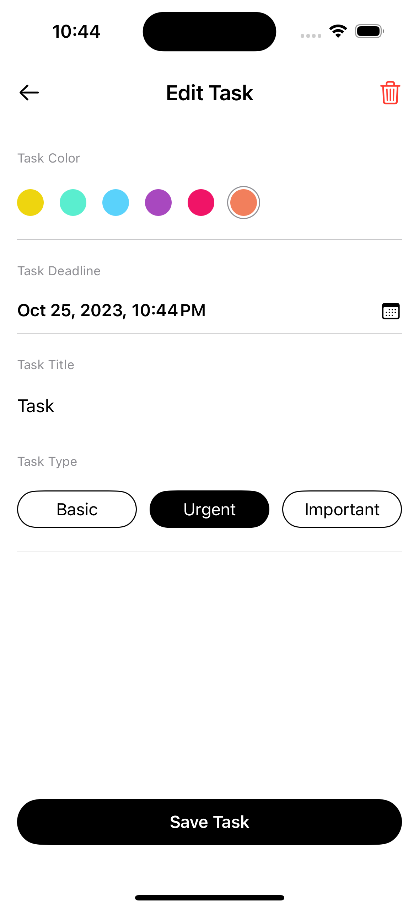
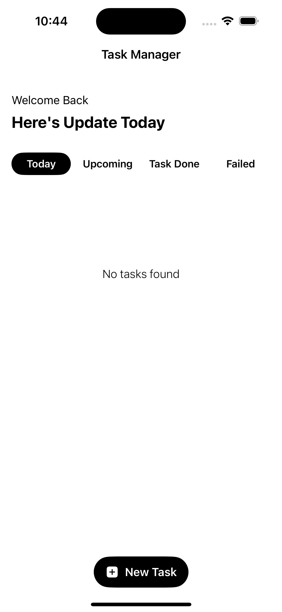
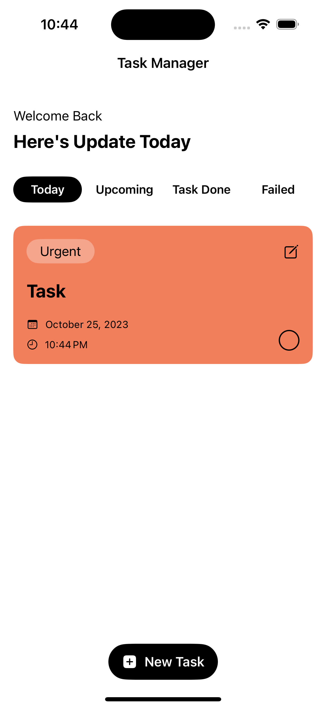
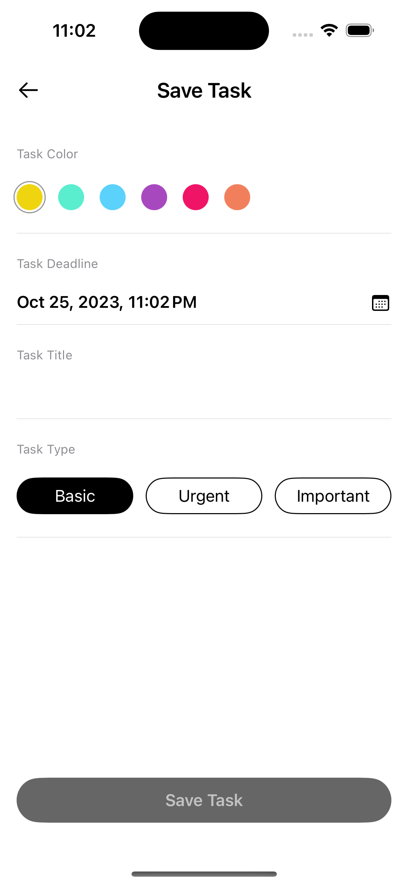

# Task Manager App

## Descrição

O "Task Manager App" é uma aplicação desenvolvida para auxiliar os usuários a gerenciar suas tarefas diárias, permitindo classificá-las por prioridade e data de conclusão. Com uma interface amigável e intuitiva, os usuários podem rapidamente adicionar, editar e excluir tarefas.

## Funcionalidades

1. **Adicionar Nova Tarefa:** O usuário pode facilmente adicionar uma nova tarefa clicando no botão "New Task".
  
2. **Editar Tarefa:** Ao selecionar uma tarefa, o usuário tem a opção de editá-la. A tarefa pode ser categorizada por cor para facilitar a identificação. Além disso, é possível definir um prazo para a conclusão da tarefa.

3. **Tipos de Tarefa:** O aplicativo permite categorizar as tarefas como "Basic", "Urgent" ou "Important", ajudando o usuário a priorizar suas atividades.

4. **Visualização Diária:** Na tela principal, o usuário pode ver um resumo das tarefas do dia, bem como as próximas tarefas, as concluídas e as que falhou em concluir.

## Screenshots

|       Edit Task       |     Home Empty     |      Home With Task       |     Save Task     |
|:---------------------:|:------------------:|:-----------------------------------------:|:--------------------------------------------:|
|  |  |  |  |

## Instruções de Uso

1. **Adicionar Tarefa:** Clique em "New Task" e preencha os detalhes necessários.
2. **Editar Tarefa:** Selecione a tarefa desejada e clique em "Edit" para fazer as alterações.
3. **Concluir Tarefa:** Marque a tarefa como concluída ao finalizá-la.
4. **Deletar Tarefa:** Selecione a tarefa e clique no ícone da lixeira para removê-la.

## Conclusão

O "Task Manager App" é uma ferramenta indispensável para quem busca organizar suas atividades diárias e aumentar sua produtividade. Com ele, você nunca mais vai esquecer de uma tarefa importante ou perder prazos.
